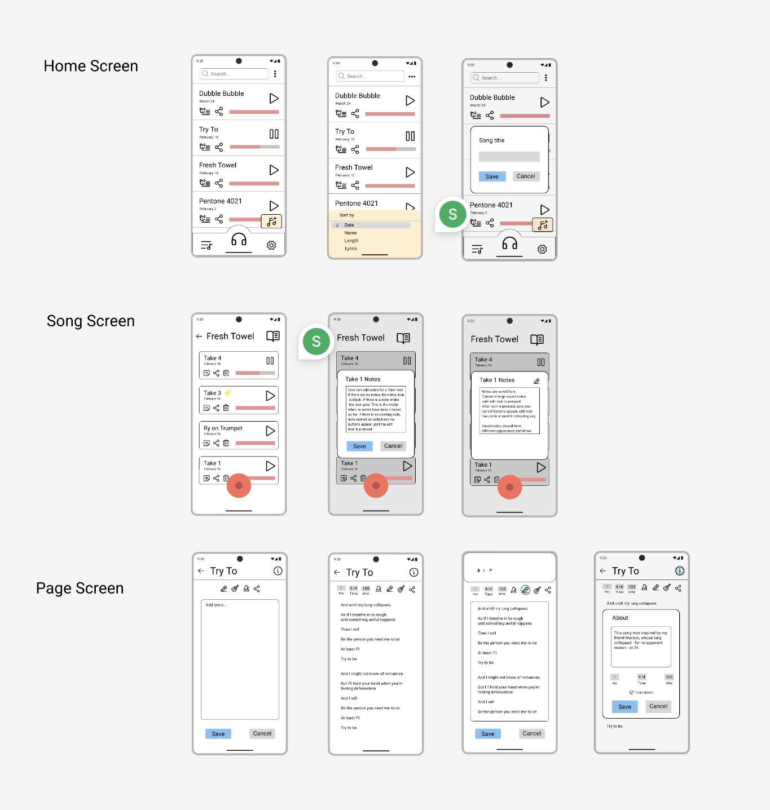

# SongJournal

---

# Overview
SongJournal is a tool for organizing song recordings and writing lyrics as well as a music player for continuous playback of recordings.

This application creates a Song Folder to store all takes of a song. All Takes are backed up to User's Google Drive. Takes can be appended with notes or renamed. Songs include a Page for adding lyrics, chords, time signature, and bpm. Groups of Pages can be exported as a print-ready pdf. User can create a Setlist of songs for continuous playback in the music player.

---
