# SongJournal - Public Readme

# Overview

Song Journal is a tool for organizing song recordings and writing lyrics.

The Starred version of a Song is displayed on the Home Screen. Pressing on a Song will open the Song Folder, containing all Takes of a Song. Takes can be appended with notes, starred, or renamed. Songs include a Lyrics Page for adding lyrics, chords, time signature, and bpm. Groups of Pages can be exported as a print-ready pdf. User can import/export an app backup and connect to Dropbox to enable autosyncing of recordings and lyrics.

## Access, share, and delete songs on Home Screen and change Theme on Settings Screen

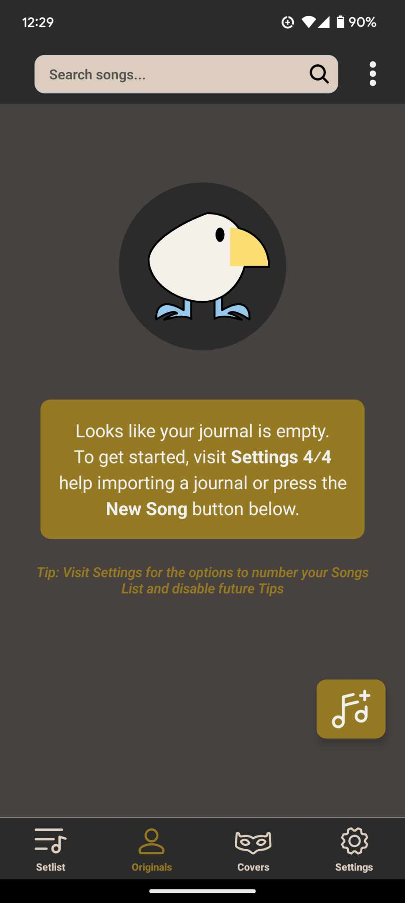
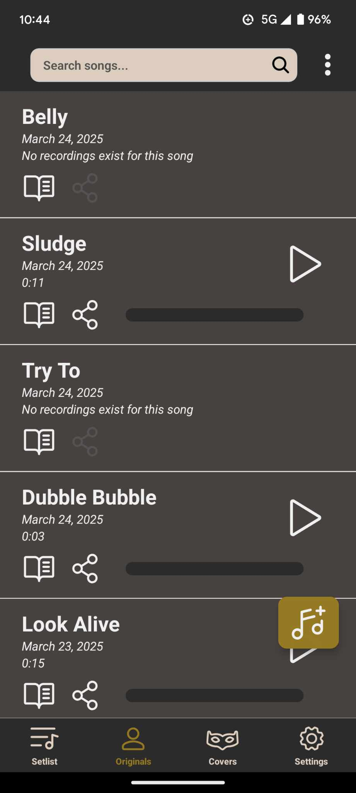
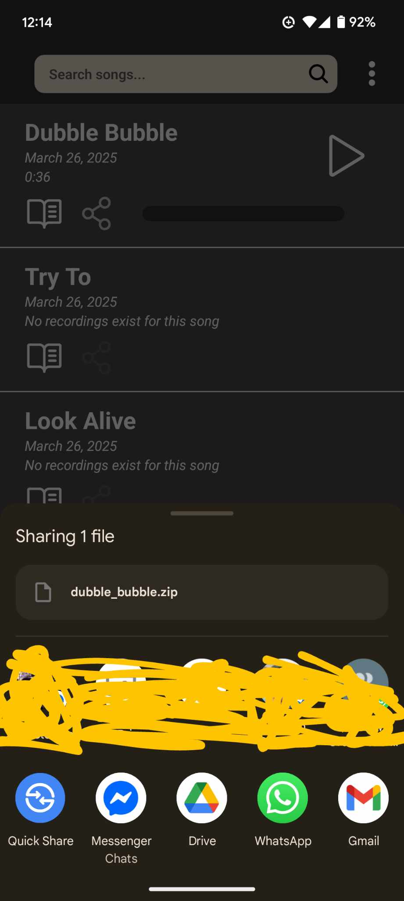

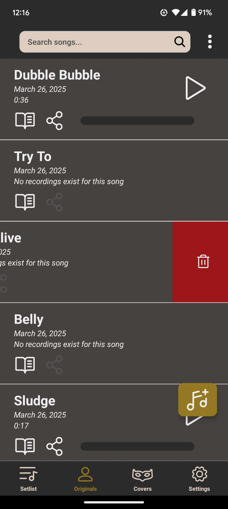
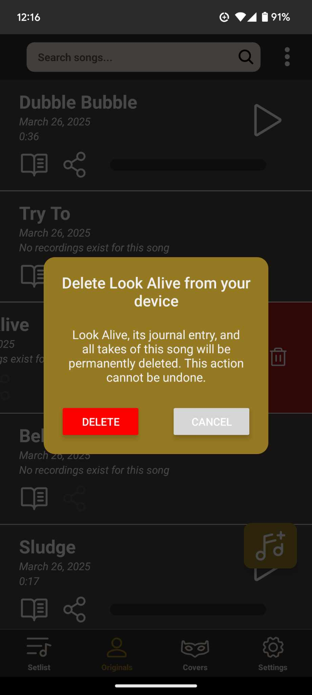

## Sort songs and create new ones

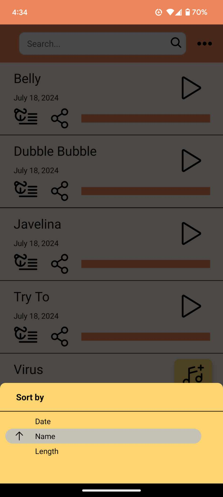
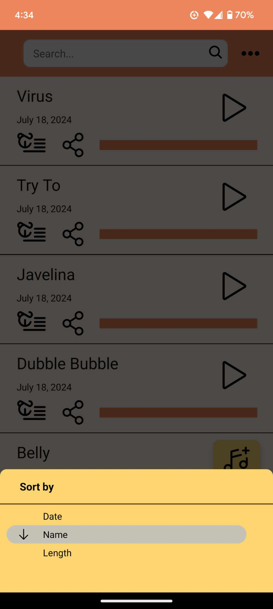
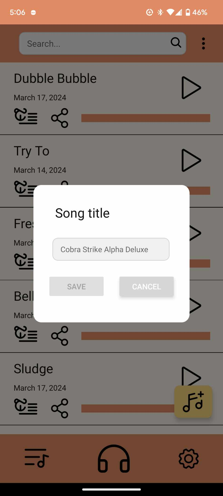

## Record, add notes, and select takes on Song Screen

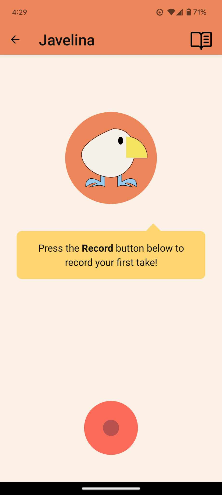
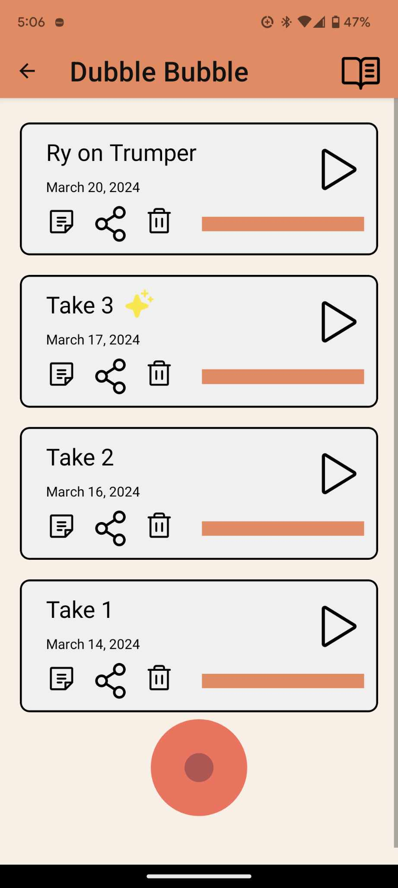
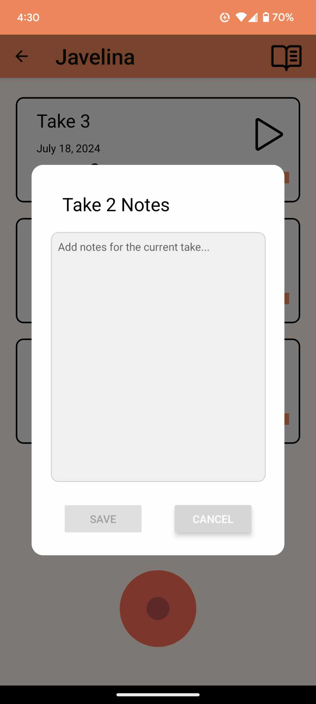

## Add lyrics and info on Lyrics Screen

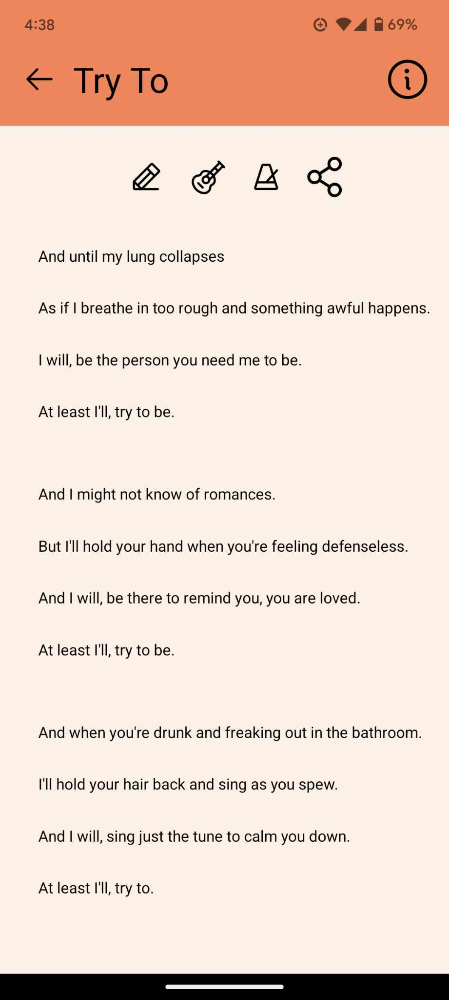
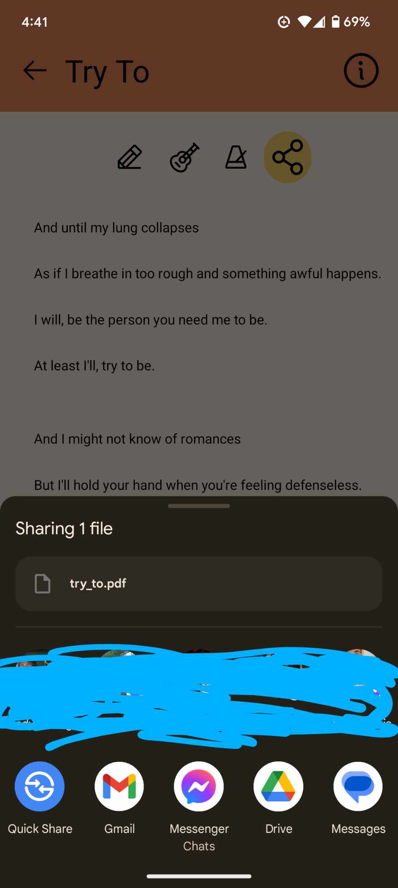
  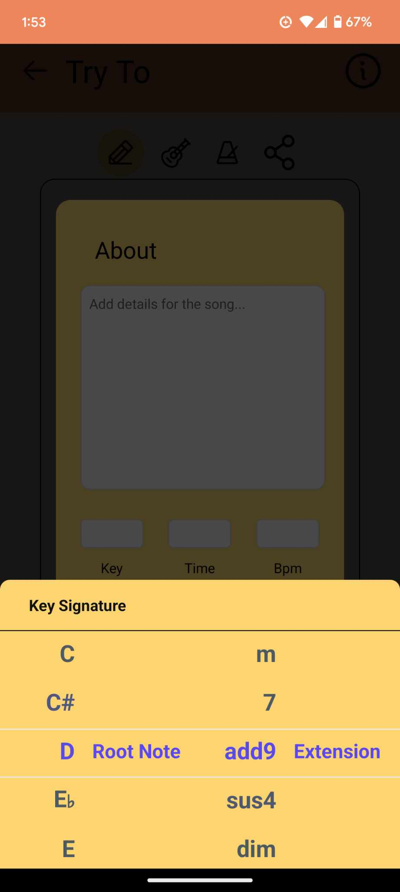
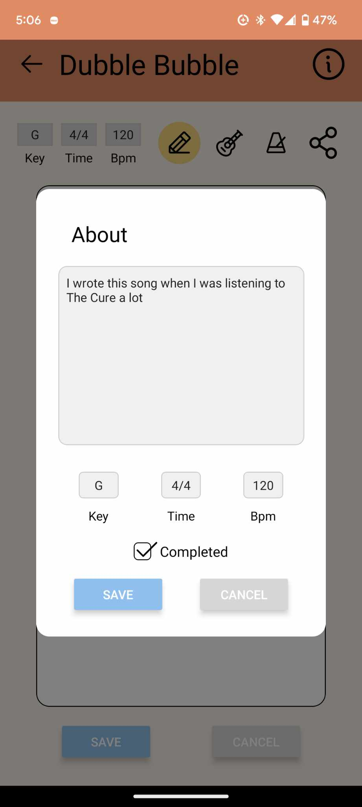

## Enable cloud storage and adjust preferences on Settings Screen

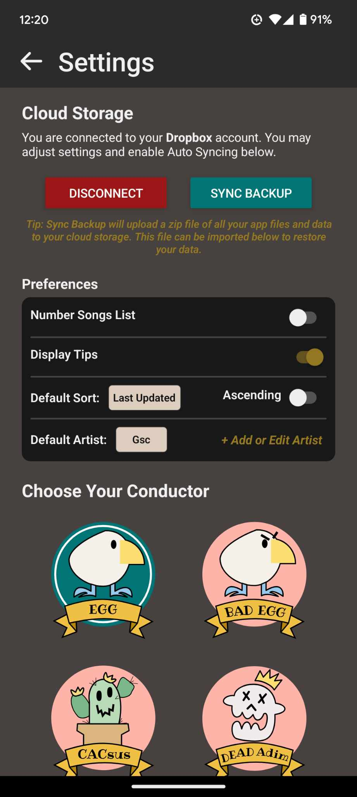
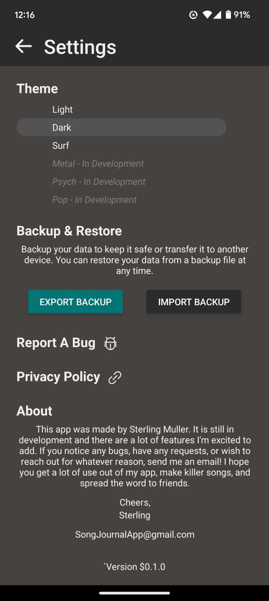

