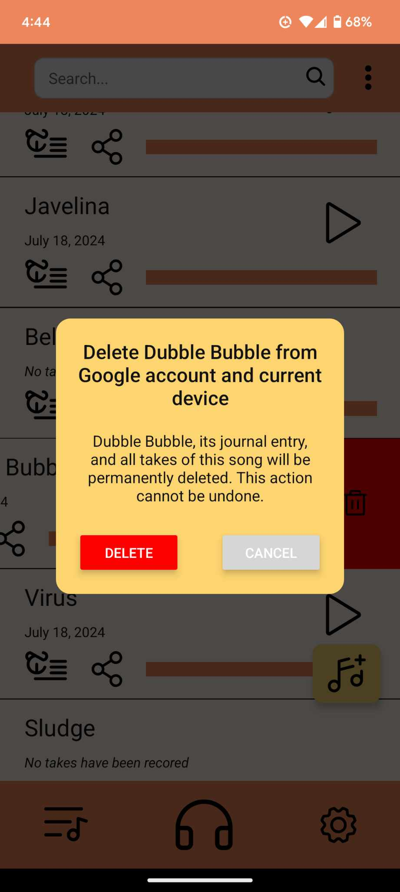

# SongJournal

# Overview

SongJournal is a tool for organizing song recordings and writing lyrics.

The Starred version of a Song is displayed on the Home Screen. Pressing on a Song will open the Song Folder, containing all takes of a song. Takes can be appended with notes, starred, or renamed. Songs include a Lyrics Page for adding lyrics, chords, time signature, and bpm. User can export songs, individual takes, or lyrics as a print-ready pdf. 

## Access, share, and delete songs on Home Screen and change Theme on Settings Screen

## Sort songs and create new ones

## Change Theme on Settings Screen

## Add lyrics and info on Lyrics Screen

## Chord Creator

## Initiate recording, add notes, and select takes on Song Screen

## Audio recording and playback on Recording Screen

